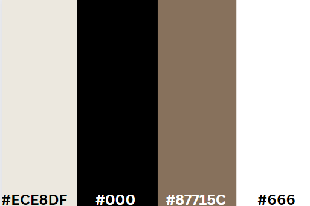
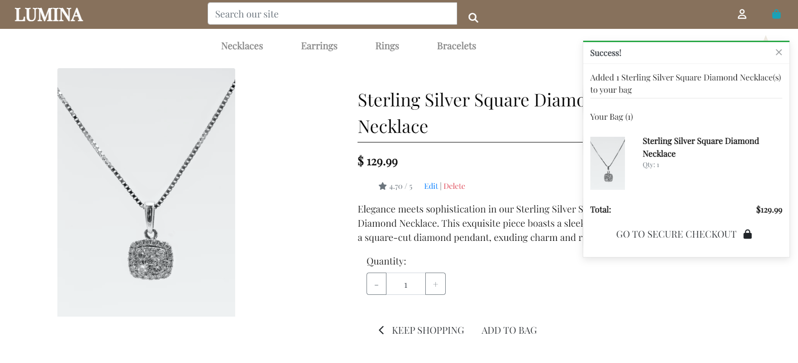
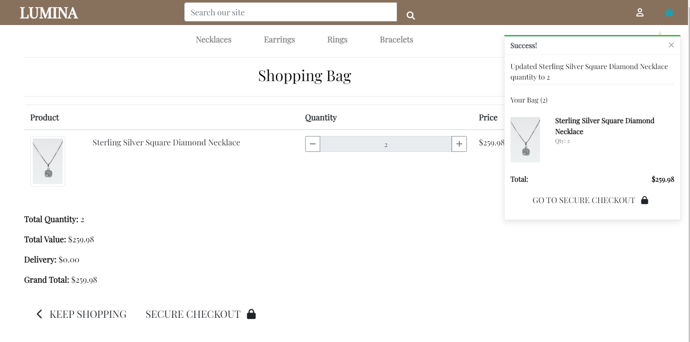
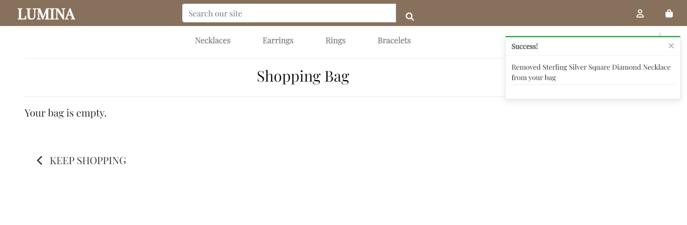
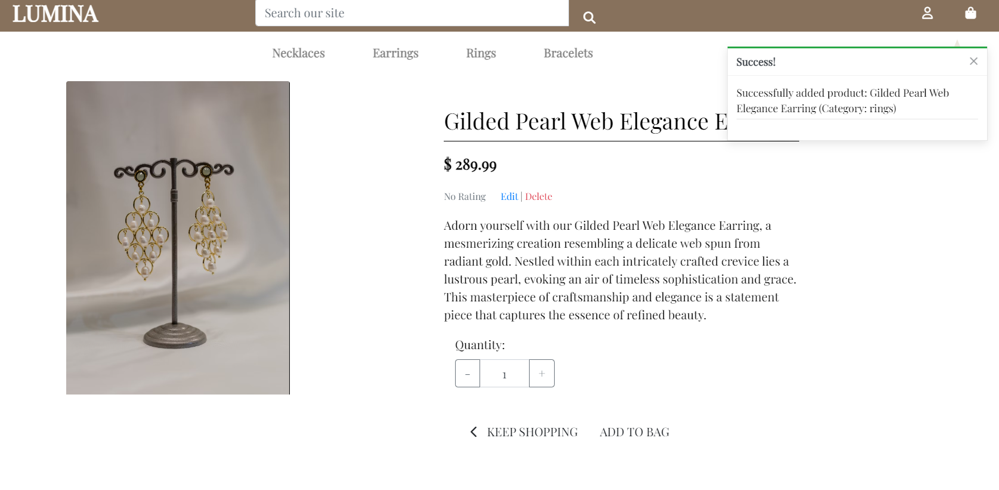
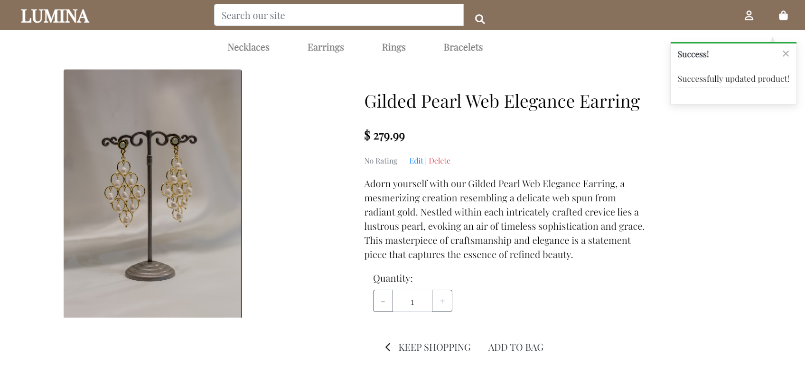
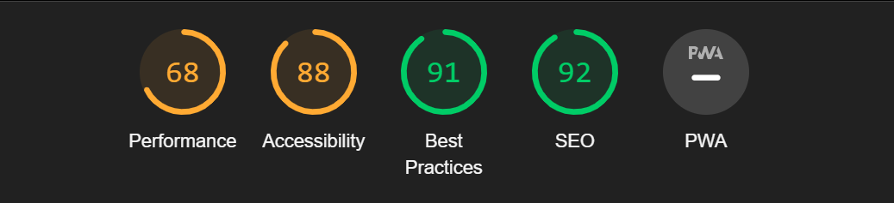

# LUMINA Jewelry Shop

This project represents a significant milestone in my journey as a Full Stack Software Developer, showcasing my skills in developing a full-fledged e-commerce website dedicated to selling exquisite jewelry. As part of my ongoing learning and development, LUMINA offers an immersive experience in discovering and purchasing stunning jewelry pieces.

Experience the allure of LUMINA by visiting the website [here](https://luminashop-43e0933e7995.herokuapp.com/) !!
---

## Table of Contents

- [Project Overview](#project-overview)
- [Features](#features)
- [How to Use](#how-to-use)
- [Key Features](#key-features)
- [Technologies Used](#technologies-used)
- [Target Audience](#target-audience)
- [Milestones](#milestones)
- [Epics](#epics)
- [UX](#ux)
- [Wireframes](#wireframes)
- [Agile Methodology](#agile-methodology)
- [Main Features](#main-features)
- [Future Features](#future-features)
- [CRUD](#crud)
- [Technologies](#technologies)
- [Tools](#tools)
- [Troubleshooting Guide](#troubleshooting-guide)
- [Project Validation](#project-validation)
- [Lighthouse Report](#lighthouse-report)
- [Deployment](#deployment)
- [Forking the Repository](#forking-the-repository)
- [References & Acknowledgements](#references--acknowledgements)
- [General Reference](#general-reference)

---

## Project Overview

LUMINA Jewelry Shop is an elegant e-commerce platform where visitors can explore and purchase a wide range of exquisite jewelry pieces. From dazzling earrings to enchanting necklaces and bracelets, LUMINA offers a curated collection for jewelry enthusiasts seeking high-quality and stylish items.

### Features

- **Product Catalog:** Explore a diverse catalog of jewelry items, featuring detailed descriptions and high-resolution images for each product.
  
- **Secure Checkout:** A seamless and secure checkout process ensures a safe and reliable transaction experience for customers.
  
- **User Accounts:** Customers can create accounts, manage their profiles, and track their order history for a personalized shopping journey.
  
- **Responsive Design:** The website is optimized for various devices, ensuring an enjoyable shopping experience on desktops, tablets, and mobile phones.

### How to Use

1. **Browsing Products:** Explore the jewelry collection by navigating through different categories or using the search functionality.
   
2. **Making a Purchase:** Select desired items, add them to the cart, and proceed to checkout. Follow the prompts to complete the purchase securely.
   
3. **User Account:** Register an account to enjoy personalized services, save favorite items, and track orders conveniently.

### Key Features

- **Product Management:** Users can add items to their shopping bag, edit quantities, and remove items before checkout.
  
- **Interactive Engagement:** Engage with the platform by commenting on products, liking favorite items, and fostering a sense of community among shoppers.
  
- **Category Navigation:** Easily explore jewelry items through various categories, simplifying the search for specific types of jewelry.
  
- **User Authentication and Permissions:** Secure user authentication ensures a safe and personalized shopping experience, with permissions to manage shopping bag items.

Feel free to explore, shop, and experience the elegance of LUMINA Jewelry Shop! If you have any feedback or inquiries, please don't hesitate to reach out.

### Technologies Used

- **Frontend:** HTML, CSS, JavaScript
- **Backend:** Django (Python)
- **Database:** 
- **Agile Development Approach**: Employing the `agile` software development methodology, the project emphasizes efficient planning and development practices, fostering adaptability and flexibility throughout the development lifecycle.
- **Payment Integration:** Stripe (Secure and seamless payment processing)
- **Hosting Platform:** Heruko (Not yet done)

## Target Audience

LUMINA Jewelry Shop is tailored for jewelry enthusiasts seeking high-quality, exquisite pieces. Whether you're a fashion-forward individual, a gift seeker, or someone with an eye for elegance, LUMINA offers a curated collection suited for various tastes and occasions. Discover the allure of fine jewelry and explore our range of stunning pieces.

Thank you for embarking on this journey of discovering elegance and beauty with us at LUMINA!

## Milestones

The project milestones were established to align with the objectives of Lumina, following an Agile methodology. These milestones include:

- **User-Centric Design**: Focused on enhancing the website's aesthetics and user experience for seamless navigation and product discovery.
- **Product Management System**: Implemented functionalities for adding, updating, and removing items from the shopping cart for a streamlined shopping experience.
- **Secure Checkout Integration**: Integrated a robust payment gateway, Stripe, ensuring secure and reliable transactions for customers.
- **User Registration and Profiles**: Enabled users to create accounts, manage profiles, and track order history, fostering a personalized shopping journey.
- **Responsive Design Implementation**: Ensured the website's compatibility across various devices, providing an optimal shopping experience on desktops, tablets, and mobile phones.
- **Admin Dashboard Development**: Empowered administrators with tools to manage products, orders, and user data efficiently.
- **User Engagement Features**: Enabled interactive elements such as product reviews, ratings, and social sharing options to encourage user interaction and community engagement.

## Epics

The main features required for this project were organized into Epics, each encapsulating general functionality for specific features and aligning with the project milestones. Below are the details of each Epic:

### Register

- **Details**: Registration is required for users who wish to interact with the platform by adding posts, liking posts, or leaving comments. User management is handled through the Django Admin panel. Access to content is available to all users, but registration is necessary for interactive features.

### Login & Logout

- **Details**: Users are encouraged to log in to add content to the platform. Once logged in, they can interact with the main content. For security reasons, users have the option to log out at any time. Access to specific pages is determined by the user's status, whether they are a general user or staff/admin.

### Admin

- **Details**: Users with admin privileges have 'staff' access, allowing them to view all areas of the site, manage posts, comments, likes, categories, and other users.

### View Products

- **Details**: Users can browse through the collection of jewelry items available on the platform. This functionality provides a catalog-style display of products with descriptions and images for users to explore.

### View Individual Products

- **Details**: Users can view detailed information about each individual jewelry product. This feature includes specific product details, images, prices, and any additional information relevant to the product.

### Add to Bag

- **Details**: Users have the ability to add desired jewelry items to their shopping bag/cart. This allows them to collect items for potential purchase before proceeding to checkout.

### Preview Bag

- **Details**: Users can preview the items in their shopping bag, reviewing the selected products along with their quantities and total prices before initiating the checkout process.

### User Profile

- **Details**: Users have access to a profile section where they can save and update their information. This includes personal details, shipping addresses, and preferences for a personalized shopping experience.

### View Older Orders

- **Details**: Users can access a section displaying their order history, allowing them to view details of their previous purchases, including order dates, items purchased, and order statuses.

### Checkout

- **Details**: Users can proceed through a secure and seamless checkout process, finalizing their purchase by providing shipping and payment information before confirming the order.

### Order Details

- **Details**: After a successful purchase, users can view detailed information about their order, including order summary, billing and shipping details, and expected delivery information.

Thank you for exploring the functionalities and features of the LUMINA Jewelry Shop!

### UX (User Experience)

- **Details**: Implemented design features to elevate user experience (UX), focusing on ergonomic, aesthetic, intuitive navigation, and simplicity.

### For Non-Registered New Users:

- **Landing Page**: Present a captivating imagery showcasing jewelry pieces with essential information about the store and a brief introduction. Display featured products prominently with links to social media platforms for easy access.
- **User Registration**: Provide the option to register for an account with a username, email, and password.
- **Product Details**: Allow users to access a detailed view of any product within the product listings.
- **Immediate Access**: After registration, direct users to browse available products immediately.
- **User-Friendly Navigation**: Ensure an intuitive and user-friendly navigation experience for first-time visitors.
- **Browser Tab Title**: Reflect the website's name and product details in the browser tab for easy identification.

### For Registered Users:

- **Safe Login and Logout**: Enable secure login and logout processes with clear confirmation messages for successful actions.

### For Registered and Logged-In Users:

- **Consistent Login State**: Display a confirmation of the logged-in state consistently across all pages.
- **Product Listings**: Provide a condensed list of jewelry items, categorized for easy exploration.
- **Product Details**: Allow users to view comprehensive details of each jewelry product.
- **Adding to Bag**: Enable users to add desired items to their shopping bag.
- **Preview Bag**: Allow users to preview and manage the items in their shopping bag before checkout.
- **Efficient Checkout**: Streamline the checkout process for a smooth and quick purchase experience.
- **Social and Site Information**: Display links to social media and essential site information across relevant pages.
- **Responsive Design**: Ensure the website's responsiveness across various devices for optimal viewing.

### For Admins:

- **Product Management**: Enable admins to create, read, update, and delete products or manage products via an admin panel.
- **User Management**: Allow admins to oversee and manage user accounts.

## Wireframes

### Navigation Bar
- **Sign In**: Access your account by providing your username and password.
- **Sign Up**: Create your account with a username, email, password, and password confirmation.
- **Home**: Return to the welcoming home page showcasing exquisite jewelry collections.
- **Products**: Explore a comprehensive range of jewelry items available for purchase.
- **Bag**: Review and manage items added to your shopping bag.
- **Checkout**: Proceed to a secure and seamless checkout process to complete your purchase.

(Authenticated Users)
- **Log Out**: Confirm your decision to log out, ensuring a seamless transition to the home page.
- **User Profile**: Access and manage your profile information, order history, and preferences.

### Home Page
- **LUMINA Jewelry Shop**: The title takes center stage, highlighting the elegance of jewelry.
- **Welcome Message**: A warm welcome message invites users to explore the captivating jewelry collections.
- **Featured Products**: Display featured jewelry items with captivating images and brief descriptions.
- **About Us**: Discover the store's purpose and commitment to providing exquisite jewelry in the "About Us" section.
- **Social Media Links**: Stay connected through our social media links in the footer.

### Login Pages
- **Sign Up**: Create your account with a username, email, password, and password confirmation to start shopping.
- **Sign In**: Access your account by providing your username and password to continue shopping.
- **Log Out**: Confirm your decision to log out, ensuring a seamless transition to the home page.

### Products Page
- **Product Catalog**: Display a comprehensive collection of jewelry items categorized for easy browsing.
- **Product Details**: Provide detailed information for each jewelry item, including images, descriptions, prices, and specifications.

### Product Detail Page
- **Product Image and Details**: Showcase a high-resolution image along with comprehensive details for the selected jewelry item.
- **Add to Bag**: Enable users to add the item to their shopping bag for purchase.

### Bag Page
- **Bag Summary**: Display a summary of items added to the shopping bag, including quantities and total prices.
- **Modify Bag**: Allow users to edit quantities, remove items, or proceed to checkout directly from the bag page.

### Checkout Page
- **Shipping Information**: Prompt users to provide shipping details for order delivery.
- **Payment Details**: Securely collect payment information for a seamless transaction process.
- **Order Summary**: Display a summary of the order before final confirmation.

## Agile Methodology

### Agile Steps for Developing LUMINA Jewelry Shop

#### 1. Planning Phase
- **Objective**: Gather requirements and plan the website's structure and functionalities.
  - **Tasks**:
    - Define the website's navigation structure, including a responsive navigation bar with links to Home, Products, Bag, Checkout, and User Profile (if applicable).
    - Outline the search functionality allowing users to explore and filter products by category, price range, or material.

#### 2. Design and Wireframing
- **Objective**: Create wireframes and design the visual layout of the website.
  - **Tasks**:
    - Develop wireframes depicting the homepage layout with featured products, about us section, and social media links.
    - Design individual product detail pages showcasing high-resolution images, product descriptions, price, and add-to-bag functionality.

#### 3. Frontend Development
- **Objective**: Build the frontend of the website focusing on user interface and interactions.
  - **Tasks**:
    - Develop the navigation bar with dropdown menus for different product categories.
    - Implement search functionality allowing users to find specific jewelry items.
    - Create individual product pages displaying detailed information and the option to add products to the bag.

#### 4. Backend Development
- **Objective**: Develop backend functionalities supporting user authentication, product management, and checkout processes.
  - **Tasks**:
    - Implement user authentication and authorization for registered users and admins.
    - Set up a database structure to manage products, user data, and order information.
    - Integrate a secure checkout system with payment gateway (e.g., Stripe) for smooth transactions.

#### 5. Testing Phase
- **Objective**: Ensure quality and functionality across the website.
  - **Tasks**:
    - Conduct thorough testing of website functionalities, including navigation, search, user authentication, and checkout.
    - Perform responsive design testing across various devices to ensure compatibility and optimal user experience.
    - Debug and resolve any issues identified during testing to maintain a stable and user-friendly website.

#### 6. User Feedback and Iteration
- **Objective**: Gather user feedback and make iterative improvements.
  - **Tasks**:
    - Collect user feedback through beta testing, surveys, or user analytics tools to understand user preferences and pain points.
    - Implement iterative improvements based on feedback to enhance usability, navigation, or additional features.

#### 7. Deployment and Maintenance
- **Objective**: Prepare for website launch and ensure ongoing maintenance.
  - **Tasks**:
    - Deploy the website to a live server, ensuring all functionalities work seamlessly.
    - Monitor website performance post-launch, address any issues, and provide ongoing support and maintenance as needed.

## Main Features

### Typography
LUMINA Jewelry Shop places significant emphasis on user experience, including thoughtful typography choices. We've meticulously selected fonts to enhance the site's visual appeal and accessibility.

#### Playfair Display
- **Usage**: Playfair Display is featured prominently for titles, navigation, and key elements, often in full capitalization.
- **CSS Usage**: `font-family: 'Playfair Display', serif;`
- **Color**: `color: #000;`

### Color
LUMINA Jewelry Shop embraces a minimalist and elegant design, primarily utilizing black-and-white elements, accentuated with strategic colors to highlight essential components.

 

- **Black**: `#000`
  - **Description**: A foundational hue providing depth and contrast throughout the website design. It emphasizes text and essential elements, contributing to a sleek and modern aesthetic.

- **Elegant Brown**: `#87715C`
  - **Description**: An elegant brown shade adding warmth and sophistication to the design. This hue is strategically used for accents and complementary elements, offering a sense of refinement.

- **White**: `#fff`
  - **Description**: Crisp and clean, white serves as the primary background color, enhancing readability and providing a sense of openness and clarity across the website.

- **Light Beige**: `#ECE8DF`
  - **Description**: A soft and light beige tone that adds a touch of warmth and subtlety. This color is used sparingly to highlight specific areas or create gentle contrasts within the design, fostering a welcoming atmosphere.

## CRUD
### CRUD Functionality for User Shopping Bag

The LUMINA Jewelry Shop implements essential CRUD operations, enabling users to manage their shopping bag efficiently. Below, we detail how these functionalities are seamlessly integrated into the website's front-end for user convenience.

#### Add to Bag

As a cornerstone of user interaction, authenticated users can easily add desired products to their shopping bag. This functionality is accessible on product pages, allowing users to select items and promptly include them in their bag for purchase.

#### Update Bag Items

Users have the ability to modify the quantity or attributes of products in their shopping bag. By accessing the 'edit' or 'update' option associated with an item in the bag, users can adjust quantities, select variations, or update any relevant details.

#### Remove from Bag

Empowering users to tailor their shopping experience, the 'remove' option enables them to delete specific items from their bag. By selecting the remove option, users can swiftly eliminate products they no longer wish to purchase.

These CRUD functionalities provide users with an intuitive and efficient shopping experience on the LUMINA Jewelry Shop. Users can effortlessly manage their shopping bags, ensuring a personalized and seamless purchasing process.

## Future Features

### Planned Feature: Social Media Login Integration

At present, the integration of social media login options, such as Google login, has not been implemented due to certain technical challenges or limitations. However, it is on the roadmap for future development.

Enabling social media login functionality is a planned enhancement aimed at providing users with a more convenient and secure authentication process, ultimately enhancing accessibility and improving the overall user experience.

Stay tuned for future updates as we work diligently to incorporate social media login options into the platform, ensuring a seamless and user-friendly authentication mechanism.

## CRUD Functionality for Product Management

### Add Product

As an admin, you can conveniently add new products to the inventory. Access the admin dashboard and navigate to the product management section to add a new product.

### Edit Product

Edit existing product details effortlessly from the admin panel. Locate the product you wish to modify and access the edit functionality.

### Delete Product

Administrators have the authority to remove products from the inventory. Easily locate the product and proceed with the deletion action.

## Technologies
LUMINA Jewelry Shop incorporates a variety of technologies to support its functionality and design:

- [Django](https://www.djangoproject.com/): Employed as the core framework for rendering database models and templates, forming the backbone of the website.
- [ElephantSQL](https://www.elephantsql.com/): Chosen for hosting and managing the website's database, ensuring seamless and efficient data storage.
- [HTML](https://en.wikipedia.org/wiki/HTML): Fundamental for creating web templates and enabling structured content presentation.
- [CSS](https://en.wikipedia.org/wiki/CSS): Utilized for custom styling, ensuring an aesthetically pleasing and user-friendly interface.
- [Bootstrap](https://getbootstrap.com/): Integrated for responsive and efficient front-end design components and layouts, enhancing user experience.
- [Django-AllAuth](https://django-allauth.readthedocs.io/en/latest/): Integrated Django application responsible for managing authentication, registration, and user account management seamlessly.
- [Stripe](https://stripe.com/): Implemented as the secure and seamless payment gateway for online transactions, ensuring user-friendly purchases.

Additionally, you can find further project requirements outlined in the [requirements.txt](requirements.txt) file.

## Tools
To ensure the efficient development of LUMINA Jewelry Shop, a variety of tools were utilized:

- [GitHub](https://github.com/): The project's repository served as the central hub for code collaboration and version control.
- [GitPod](https://gitpod.io/): An online integrated development environment (IDE) used for coding, file management, and terminal operations, facilitating efficient development workflow.
- [Heroku](https://heroku.com/): Selected as the deployment and hosting platform, providing accessibility and a seamless user experience.
- [Chrome Dev Tools](https://developer.chrome.com/docs/devtools/): Leveraged for debugging, testing, and optimizing the project's front-end, ensuring a responsive and polished website.

These technologies and tools collectively facilitated the development, testing, and deployment of the LUMINA Jewelry Shop, ensuring a robust and efficient project workflow.

## Troubleshooting Guide

### JavaScript Error Encountered with Bootstrap Toasts

#### Error Description:
When attempting to implement toasts in the web application using Bootstrap, a JavaScript error occurred due to incorrect or missing integrity hashes in the script tags. The error message displayed in the console indicated: "Error parsing 'integrity' attribute ('YOUR_INTEGRITY_HASH'). The hash algorithm must be one of 'sha256', 'sha384', or 'sha512', followed by a '-' character."

#### Solution to Resolve the Error:
1. **Access the SRI Hash Generator:**
   - Visit [SRI Hash Generator](https://www.srihash.org/) in your browser.

2. **Enter JavaScript URLs:**
   - Insert the URLs of the external JavaScript files (`popper.js` and `bootstrap.bundle.min.js`) into the SRI hash generator.

3. **Generate Integrity Hashes:**
   - Use the SRI hash generator tool to generate integrity hashes by clicking the "Hash" or "Generate" button.

4. **Retrieve Generated Hashes:**
   - Copy the integrity hashes generated by the SRI hash generator tool for each JavaScript file.

5. **Update HTML File:**
   - Replace the placeholder "YOUR_INTEGRITY_HASH" in the integrity attribute of the respective script tags with the actual hashes obtained from the SRI hash generator.

6. **Save and Apply Changes:**
   - Save the updated HTML file containing the corrected integrity hashes for the script tags.

7. **Testing:**
   - Verify the changes by reloading the web application to ensure that the JavaScript files are loaded without any integrity hash errors.

By following these steps and updating the integrity hashes in the HTML file with the hashes generated from the SRI hash generator, you can rectify the integrity attribute issue and ensure proper loading of external JavaScript files in your web application.

## Bugs

### Bug 1: Issues with Search Results and Message Display

#### Issue:
When users searched for products using singular terms (e.g., "ring"), unrelated items were also displayed (e.g., "earrings"). Additionally, the "products not found" message failed to appear when no relevant items were found.

#### Bug Details:
The search functionality did not distinguish between plural and singular forms of search terms, resulting in broader matches than intended. This caused incorrect filtering, leading to unrelated products being displayed for singular search queries. Furthermore, the "products not found" message failed to trigger when there were no matching products.

#### Resolution Steps:
1. Utilized the Python `inflect` library to handle both plural and singular forms of search terms.
2. Incorporated regular expressions to match whole words, preventing partial word matches and enhancing search accuracy.
3. Modified the code logic to correctly trigger the "products not found" message when no relevant search results were found.

#### Code Changes:

- Revised the search query to consider both plural and singular forms of search terms.
- Implemented regular expressions to match whole words and filter search results more accurately.
- Corrected the logic to trigger the "products not found" message appropriately.

### Bug 2: Quantity Input in Product Details Page + Keep Shopping button

#### Issue:
The Keep Shopping button stopped functioning after adding items to the bag. Clicking the button did not redirect users as expected.

#### Bug Details:
Upon adding items to the bag, the functionality of the Keep Shopping button was affected. It failed to redirect users to the all products page after an item was added.

#### Resolution Steps:
1. Identified the conflict between the form action and the Keep Shopping button within the product_details.html file.
2. Separated the form action for adding items to the bag from the Keep Shopping button to resolve the conflicting behavior.
3. Modified the code to include a separate href link for the Keep Shopping button, redirecting users to the desired all products page while maintaining the functionality of the Add to Bag button.

#### Code Changes:

- Adjusted the structure within product_details.html by creating a separate href link for the Keep Shopping button to ensure independent functionality from the Add to Bag button. This change resolved the conflict and allowed the Keep Shopping button to redirect users correctly.

### Unresolved Bugs
#### Bug 3: Issue with Stripe Webhook Functionality
#### Issue:
Webhooks from Stripe are not functioning correctly, resulting in a disruption of payment processing and data synchronization.

#### Bug Details:
The webhook functionality integrated with Stripe is failing to trigger expected events, causing a breakdown in payment processing and the synchronization of critical data related to transactions and user actions.

#### Next Steps (Pending Resolution):
- Review and compare the webhook configuration settings in the Stripe dashboard with the implemented code to identify discrepancies.
- Test the functionality using Stripe's test webhooks to verify the system's response to various events and debug any issues encountered.
- Inspect the event handlers in the codebase to ensure they are correctly set up to handle Stripe webhook events.
- Implement enhanced logging and error handling mechanisms to capture and investigate any errors or issues occurring during webhook processing.

## Lighthouse Report

The current Lighthouse audit results for this project showcase the following scores:

### Performance Enhancement Strategy:

#### Ongoing Improvements:

The performance score of 68 indicates room for enhancement in terms of website speed and optimization. To further elevate the site's performance, the following actions are planned:

1. **Image Optimization**: Optimize images by compressing and resizing them without compromising quality. Use modern image formats where possible (such as WebP) to reduce file sizes.
   
2. **Minimizing Render-Blocking Resources**: Implement techniques like asynchronous loading, deferred loading, or code-splitting to minimize the impact of render-blocking CSS and JavaScript files.

3. **Browser Caching**: Set appropriate caching headers for static resources to leverage browser caching effectively, reducing server load and improving load times for returning visitors.

4. **Code Minification and Compression**: Minify CSS, JavaScript, and HTML files to reduce their sizes. Implement compression (Gzip or Brotli) to deliver smaller file sizes to users' browsers.

5. **Eliminating Unused Code**: Remove unused CSS/JS to reduce payload size. Consider using tools like PurifyCSS or tree-shaking for JavaScript to eliminate unnecessary code.

6. **Critical Rendering Path Optimization**: Prioritize critical CSS and defer non-critical JavaScript to improve initial load time.

7. **Lazy Loading**: Implement lazy loading for below-the-fold content to defer loading until it comes into view.

8. **Optimizing Third-Party Scripts**: Limit or optimize third-party scripts to minimize their impact on page load times.

9. **Server-Side Optimization**: Optimize server response time by caching queries and using efficient coding practices.

10. **Content Delivery Network (CDN)**: Consider using a CDN to distribute content globally, reducing latency for users in different locations.

By implementing these improvements, the goal is to enhance the website's performance, aiming for a higher score and an optimized user experience.

## Deploying on Heroku

Follow these steps to deploy your project on Heroku:

1. **Sign Up or Log In**: If you don't have an account, [create one on Heroku](https://www.heroku.com/) and log in.

2. **Create a New App**: In your Heroku dashboard, click "New" and choose "Create new app."

3. **Name Your App**: Pick a suitable name and choose your region.

4. **Set Environment Variables**:
   - Open the "Settings" tab.
   - Click "Reveal Config Vars."
   - Add key-value pairs from your .env file (excluding DEBUG and DEVELOPMENT variables).

5. **Add Python Buildpack**:
   - In "Settings," under "Add buildpack," select "python" from the list and save.

6. **Connect to GitHub**:
   - Visit the "Deploy" tab.
   - Choose "GitHub - Connect to GitHub" under deployment methods.
   - Find and select your GitHub repository.
   - Enable automatic deploys to update your site when you push code to GitHub.

7. **Preview Your Site**: Click "View" to see your deployed site on Heroku.

## Forking the Repository

To fork this repository on GitHub, follow these steps:

1. **Sign Up or Log In**: If you're not logged in, sign in to GitHub or create an account.

2. **Find the Repository**: Go to the GitHub Repository you want to fork.

3. **Fork the Repository**: Click the 'Fork' button in the top right corner.

4. **Rename Your Fork** (Optional): Customize the repository name as needed.

5. **Create Your Fork**: Click "Create Fork" to create your own version of the repository.

## References & Acknowledgements
- Gitpod repository template provided by [Code Institute](https://codeinstitute.net)
  

## General Reference
- [Python](https://www.python.org/)
- [PyPi](https://pypi.org/)
- [Real Python](https://realpython.com/)
- [Card Hover](https://ordinarycoders.com/blog/article/codepen-bootstrap-card-hovers)
- [Django Reference](https://docs.djangoproject.com/)
- [Django Slugs 1](https://forum.djangoproject.com/t/django-how-to-add-slug-as-arguments-in-url-tag-using-django/12636)
- [Django Slugs 2](https://forum.djangoproject.com/t/passing-slug-to-createview/4287)
- [Django AllAuth](https://django-allauth.readthedocs.io/en/latest/)
- [Stripe API Reference](https://stripe.com/docs/api)
- [HTML Reference](https://developer.mozilla.org/en-US/docs/Web/HTML)
- [CSS Reference](https://developer.mozilla.org/en-US/docs/Web/CSS)
- [JavaScript Reference](https://developer.mozilla.org/en-US/docs/Web/JavaScript)
